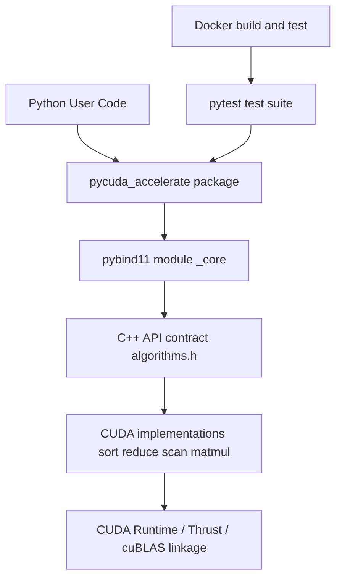

# PyCuda-Accelerate

PyCuda-Accelerate is a Python package that exposes CUDA-backed array primitives through a compact NumPy-first API. It focuses on four operations that are commonly used in data and ML preprocessing paths:

- 1D sort
- 1D reduction (`sum`, `min`, `max`)
- 1D exclusive prefix scan
- 2D matrix multiplication (`A @ B`)

The project is built around:

- A Python-first API (`numpy.ndarray` in, `numpy.ndarray` out)
- Native execution through CUDA C++
- A build system that works both as a Python package (`pip`) and as a standalone CMake project
- Docker-based validation workflows

At runtime, each API call takes host-side NumPy buffers and executes the requested operation on GPU-backed implementations. The high-level flow is consistent across operations:

1. Validate input shape and type assumptions in the Python binding layer.
2. Release the Python GIL during native execution.
3. Dispatch into C++ API functions.
4. Execute CUDA/Thrust kernels or CUDA-backed primitives.
5. Return results to Python as new NumPy arrays (or a scalar for reduce).

This keeps the public API simple while shifting compute-heavy work out of Python.

## How It Works Internally

- Python bindings live in `python/bindings.cpp` and expose the `_core` module.
- Bindings call the native function contract in `src/algorithms.h`.
- CUDA implementations are split by operation in `src/algorithms/*.cu`.
- Errors from CUDA calls are turned into C++ exceptions via `src/utils/cuda_check.h`, which pybind11 maps to Python exceptions.

Execution details:

- Inputs are expected to be C-contiguous float32 arrays (`forcecast` is enabled on binding entry points).
- Shape checks happen before dispatch to native code.
- `py::gil_scoped_release` is used so Python threads are not blocked while GPU work runs.
- Invalid parameter paths (for example, an unsupported reduce op) are rejected early.

## Architecture



## Repository Layout

- `python/pycuda_accelerate`: package entry point, typing stubs, typed marker
- `python/bindings.cpp`: pybind11 binding definitions and validation logic
- `src/algorithms.h`: stable native API contract used by bindings
- `src/algorithms`: CUDA/C++ operation implementations
- `src/utils`: CUDA error-checking and utility helpers
- `tests`: pytest-based validation for shape checks and GPU behavior
- `docker`: reproducible build/test containers
- `.github/workflows`: CI for build/test and release wheel publishing

## Prerequisites

- Python 3.9+
- CMake 3.24+
- CUDA Toolkit 12.2 (primary baseline)
- A compiler toolchain supported by your CUDA toolkit

## API Surface

- `gpu_sort(input: float32[1D]) -> float32[1D]`
    Uses a CUDA-backed sort path through Thrust to sort 1D float data.
- `gpu_reduce(input: float32[1D], op: "sum"|"min"|"max") -> float`
    Supports `sum`, `min`, and `max`; operation is validated before GPU allocation and dispatch.
- `gpu_prefix_scan(input: float32[1D]) -> float32[1D]` (exclusive scan)
    Performs an exclusive scan over 1D input.
- `gpu_matmul(a: float32[2D], b: float32[2D]) -> float32[2D]`
    Runs a tiled CUDA GEMM kernel for row-major `float32` matrices.

Behavior notes:

- Non-contiguous or non-float32 inputs are coerced through pybind11 (`forcecast` path).
- Shape mismatches return explicit Python exceptions.

## Build and Install

### Local editable install

```bash
python -m pip install --upgrade pip
pip install -e .[dev]
```

### CMake build (native)

```bash
cmake -S . -B build -DBUILD_PYTHON_BINDINGS=ON
cmake --build build -j
```

### Python tests

```bash
pytest tests/ -v
```

## Docker

The Docker image builds the package and runs tests in a controlled CUDA-devel environment.

### Build image

```bash
docker build -t pycuda-accelerate:dev -f docker/Dockerfile .
```

### Run tests

```bash
docker run --rm pycuda-accelerate:dev
```

### Run tests with GPU (requires NVIDIA Container Toolkit)

```bash
docker run --rm --gpus all pycuda-accelerate:dev
```

### Compose test service

```bash
docker compose -f docker/docker-compose.yml up --build test
```

### Compose GPU test profile

```bash
docker compose -f docker/docker-compose.yml --profile gpu up --build test-gpu
```

## Usage

```python
import numpy as np
from pycuda_accelerate import gpu_sort, gpu_reduce, gpu_prefix_scan, gpu_matmul

x = np.array([3.0, 1.0, 2.0], dtype=np.float32)
print(gpu_sort(x))
print(gpu_reduce(x, op="sum"))
print(gpu_prefix_scan(x))

A = np.random.randn(32, 64).astype(np.float32)
B = np.random.randn(64, 16).astype(np.float32)
C = gpu_matmul(A, B)
```

All operations are designed for straightforward correctness and explicit failure behavior, with performance-sensitive paths implemented in CUDA.

## Testing Strategy

- Unit tests validate error handling (invalid shapes, invalid op).
- GPU tests validate numeric correctness against NumPy reference behavior.

## CI/CD

- `build-and-test.yml`: multi-Python build and test workflow on GPU-capable runners
- `publish.yml`: release workflow that builds CUDA 11.8 and 12.2 wheel variants and publishes artifacts
